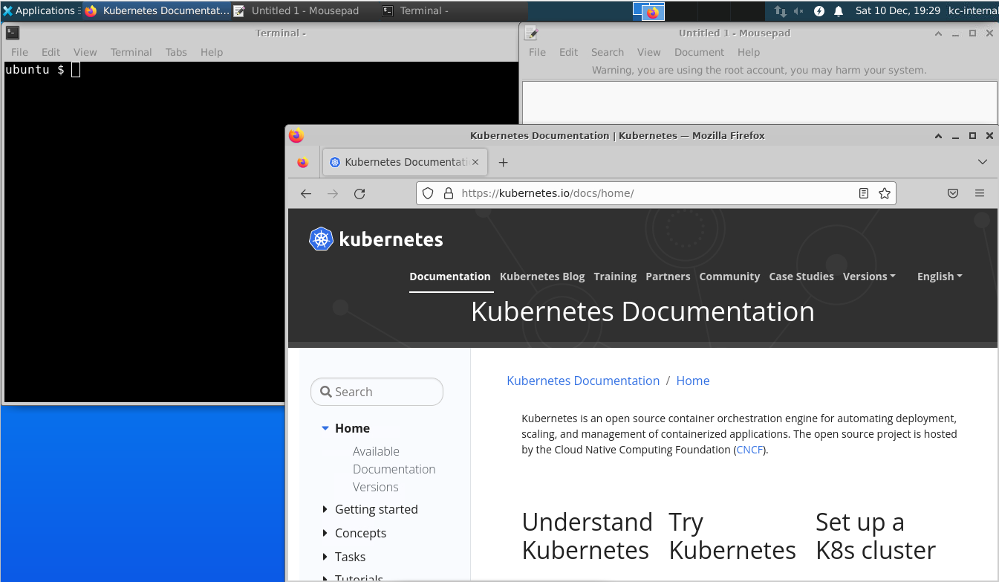

考了 k8S CKA 證書，總結一下經過和要點。

<!--more-->

考了 K8S CKA 的考試，考試是 2022 年 7 月特價的時候買的，花了 275 美元，原價是 375 美元。拖了半年才考，還挺簡單的。
真實考試比 killer 的模擬考試簡單很多，太概 70 分鐘就做完了，killer 的模擬考試就算熟練也差不多要 110 分鐘。能過 killer 的模擬考試基本都不用擔心。  
補充，第二天就收到合格的電郵，證書放在 AWS 的 S3 storage 上，可以隨時看
https://ti-user-certificates.s3.amazonaws.com/e0df7fbf-a057-42af-8a1f-590912be5460/2619881f-c1df-4f11-a4aa-c695e7ca18da-yip-wai-lung-9f8a1f2c-bffd-4e9a-a49d-e9ed7e296835-certificate.pdf

## 考試流程

1. 網上報名，報名之後一年內可以考，可以重考一次。
2. 到[killer.sh]練習。
3. 到[trainingportal]預約考試時間。  
   這裡還有 Handbook 跟 Important Instructions，最好看一下。
4. 準備好房間(沒有其他人)，攝像頭(要可移動的)，麥克風(不能用頭載式耳機)，身份證明(我是用護照的)。
5. 預先關掉所有其他程式，我是用新建立的 windows 用戶的，比較乾淨。
6. 考試時間的 30 分鐘前要到[trainingportal]下載跟安裝 PSI 瀏覽器，花了大約 20 分鐘。開啟瀏覽器的時候會告訴你還有什麼程式需要關閉。瀏覽器要我關掉 hyper-v 的服務，花了 5 分鐘才關掉。
7. 開啟瀏覽器後會有人檢查你的身份證明，房間。對話都是打字的，不用講話。
   檢查房間要拿起攝像頭，按照指示拍攝周圍，桌面桌底不能有雜品，電腦跟電線都可以，飲品只能是水，茶都不行。  
    這個檢查比較久，檢查了大約 20 分鐘，但不用擔心，檢查不算考試時間的。
8. 然後開始考試。

## 考試環境

2022 年中更換考試環境，不再只有 terminal 了，轉成 VM，可以用 firefox 查官網文檔，可以用 ubuntu 的 mousepad，類似 nodepad 的東西。

在 mousepad 改完 yaml 檔案再複製進 vim，不用精通 vim 了，只要會複製貼上就可以，複製貼上記得用`Ctrl+Shift+c` 和 `Ctrl+Shift+v`。  
但是因為是遠程控制 VM，移動 firefox 的時候非常慢，盡量不要動它，mousepad 跟 terminal 倒是很順暢，設定都不用改。PSI 瀏覽器會佔了上面一部份畫面，畫面會比較小。  
因為不能紀錄真畫面，這是在 killercoda 模擬出來的，有需要可以自己試試。  
https://killercoda.com/kimwuestkamp/scenario/cks-cka-ckad-remote-desktop

## 題目

只有 17 題，都不難，下面是我記得的。

- create node port service
- create ingress
- create pod with shared volume
- fix a worker node
- create network policy
- upgrade kubeadm, kubectl, kubelet in master node to newer version
- backup and restore etcd
- count ready worker node and type into a text file
- create deamonset that deploy on every node include master node
- create cluster role and bind to a service account
- create pvc and mount into a pod, then change volume size
- output log from a pod to a text file
- scale deployment to 3

## 參考連結

- [Certified Kubernetes Administrator (CKA)](https://training.linuxfoundation.org/certification/certified-kubernetes-administrator-cka/)
  這裡付錢
- [Training Portal](https://trainingportal.linuxfoundation.org/learn/dashboard)
  這裡預約考試
- [killer.sh](https://killer.sh/dashboard)
  買了考試可以在這裡練習，每次可以用 36 小時，可以用 2 次。
- [killercoda](https://killercoda.com/)
  這是免費版 killer，題目比較少。
- [handbook](https://docs.linuxfoundation.org/tc-docs/certification/lf-handbook2/taking-the-exam)
- [Important Instructions: CKA and CKAD](https://docs.linuxfoundation.org/tc-docs/certification/tips-cka-and-ckad)
- [Frequently Asked Questions: CKA and CKAD & CKS](https://docs.linuxfoundation.org/tc-docs/certification/faq-cka-ckad-cks)

[trainingportal]: https://en.wikipedia.org/wiki/Hobbit#Lifestyle
[killer.sh]: https://killer.sh/dashboard
