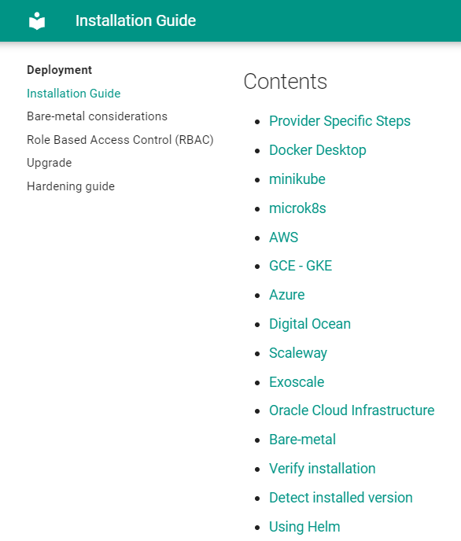
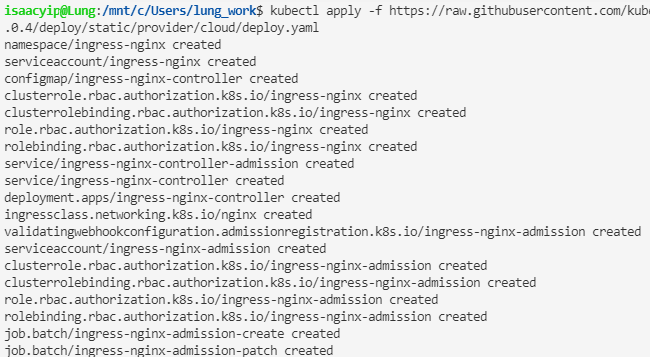
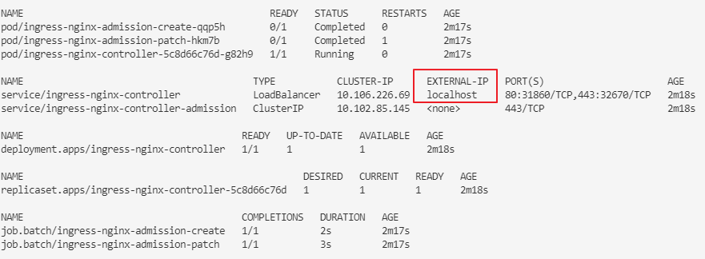
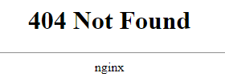
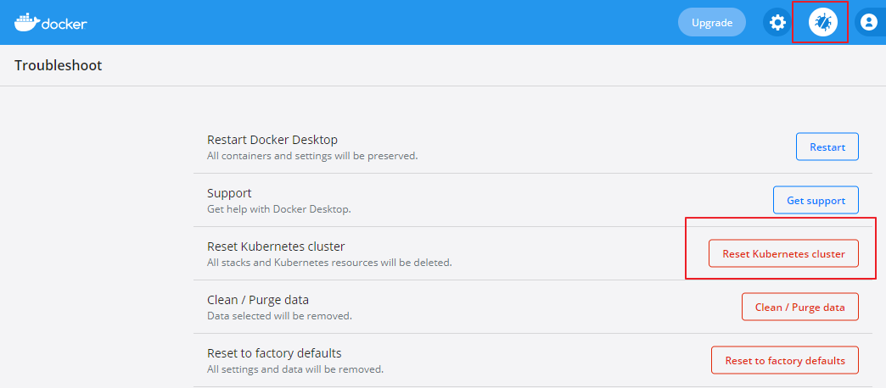

如何安裝 ingress-nginx

<!--more-->

# 安裝 ingress nginx

## 前言

此文章使用以下設定

|                   | Version      |
| ----------------- | ------------ |
| Windows           | Windows 10   |
| wsl2 linux        | Ubuntu-20.04 |
| Docker Desktop    | 4.1.1(69879) |
| Docker Kubernetes | v1.21.5      |

要注意 `ingress-nginx` 由 K8S 開發.
`nginx-ingress` 是由 nginx 開發，雖然都是用`nginx`作為 reverse proxy server 但設定上會有差別。

## 安裝

官網有提供各種安裝的選擇
[Installation Guide - NGINX Ingress Controller (kubernetes.github.io)](https://kubernetes.github.io/ingress-nginx/deploy/#contents)



此文使用 Docker Desktop. 如果 k8s 是安裝在伺服器上，請選擇 Bare-metal.

```shell
kubectl apply -f https://raw.githubusercontent.com/kubernetes/ingress-nginx/controller-v1.0.4/deploy/static/provider/cloud/deploy.yaml
```

可以看到 k8s 會建立一堆資源



用以下命令查看資源狀態，可以看到 `EXTERNAL-IP` 是 localhost。

```shell
kubectl get all -n ingress-nginx
```



Ingress controller 啟動後需要一定時間取得 `EXTERNAL-IP` ，如顯示 pending，請等待 1-2 分鐘。

在 browser 輸入網址 <http://localhost/> 可以看到以下畫面，代表安裝成功。



如果 `EXTERNAL-IP` 一直顯示 `pending`，可以賞試在 Docker Desktop Troubleshoot 頁面 Reset Kubernetes cluster 然後重新啟動 Docker Desktop.

再重新安裝 ingress-nginx.



### Bare-metal ingress

如果是使用 bare-metal，安裝在另外的伺服器上，需要自行填上自己伺服器的 IP。

```shell
kubectl patch service ingress-nginx-controller -n ingress-nginx --patch '{"spec": {"externalIPs": ["172.28.240.1"] }}'
```

也可以安裝 [MetalLB](https://metallb.universe.tf/)，自動分派 IP，此處不詳述。

## 移除安裝

```shell
kubectl delete -f https://raw.githubusercontent.com/kubernetes/ingress-nginx/controller-v1.0.4/deploy/static/provider/cloud/deploy.yaml
```
