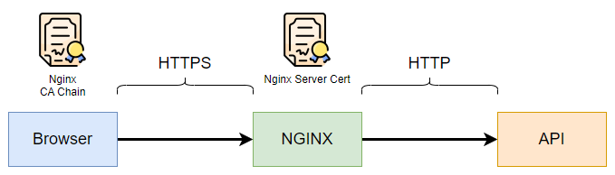
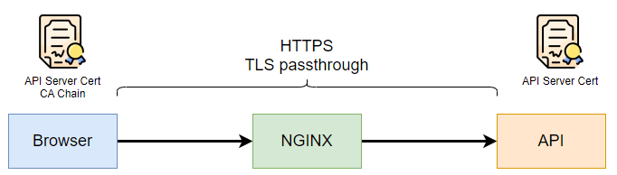
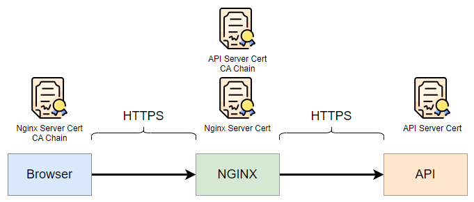

教你使用 Proxy 跟 HTTPS 的 3 種模式

<!--more-->

# 如何在 K8S 設定 HTTPS

## 使用 Proxy 跟 HTTPS 的 3 種模式

### TLS termination

nginx 把 HTTP 解密後以明文方或傳送到後方。

- 設定方便，只需設定 nginx
- 安全性較低
  

### TLS passthrough

nginx 不進行解密，用 TCP protocol 傳送資料到 API。

- 由於 nginx 不解密，部份功能無法使用，例如修改 HTTP Header，把內容傳送到 log 系統等等
- 安全性比 TLS termination 高
  

### TLS termination + TLS backend

nginx 把 HTTP 解密後，再使用 TLS 加密才傳送到後方，兩段 HTTPS。

- 安全性比 TLS termination 高，比 TLS passthrough 低
- nginx 可以進行解密，並使用修改 HTTP Header，log 等功能
- 設定繁瑣
  

## 建立 Namespace

```bash
kubectl create namespace sandbox
kubectl config set-context --current --namespace=sandbox
```

## 準備憑證 Prepare Certificate

- 安裝 cert manager

```bash
kubectl apply -f https://github.com/cert-manager/cert-manager/releases/download/v1.8.0/cert-manager.yaml
```

- 建立 Self Sign Root CA

```bash
cat <<EOF | kubectl apply -f -
apiVersion: cert-manager.io/v1
kind: Issuer
metadata:
  namespace: sandbox
  name: selfsigned-issuer
spec:
  selfSigned: {}
---
apiVersion: cert-manager.io/v1
kind: Certificate
metadata:
  namespace: sandbox
  name: root-ca
spec:
  isCA: true
  commonName: Root CA
  secretName: root-ca
  usages:
    - signing
    - cert sign
    - crl sign
  privateKey:
    encoding: PKCS8
    algorithm: ECDSA
    size: 256
  issuerRef:
    name: selfsigned-issuer
---
apiVersion: cert-manager.io/v1
kind: Issuer
metadata:
  namespace: sandbox
  name: root-ca-issuer
spec:
  ca:
    secretName: root-ca
EOF
```

- 建立 Intermediate CA

```bash
cat <<EOF | kubectl apply -f -
apiVersion: cert-manager.io/v1
kind: Certificate
metadata:
  namespace: sandbox
  name: inter-ca
spec:
  isCA: true
  commonName: Intermediate CA
  secretName: inter-ca
  usages:
    - signing
    - cert sign
    - crl sign
  privateKey:
    encoding: PKCS8
    algorithm: ECDSA
    size: 256
  issuerRef:
    name: root-ca-issuer
---
apiVersion: cert-manager.io/v1
kind: Issuer
metadata:
  namespace: sandbox
  name: inter-ca-issuer
spec:
  ca:
    secretName: inter-ca
EOF
```

- 建立 Nginx 伺服器憑證 Nginx Server Cert

```bash
cat <<EOF | kubectl apply -f -
apiVersion: cert-manager.io/v1
kind: Certificate
metadata:
  namespace: sandbox
  name: nginx-server-cert
spec:
  isCA: false
  secretName: nginx-server-cert
  commonName: Nginx Server Cert
  dnsNames:
    - localhost
    - test-nginx-server.com
    - test-nginx-api-server.com
  usages:
    - digital signature
    - key encipherment
    - server auth
  privateKey:
    encoding: PKCS8
    algorithm: ECDSA
    size: 256
  issuerRef:
    name: inter-ca-issuer
EOF
```

- 建立 API 伺服器憑證 API Server Cert

```bash
cat <<EOF | kubectl apply -f -
apiVersion: cert-manager.io/v1
kind: Certificate
metadata:
  namespace: sandbox
  name: api-server-cert
spec:
  isCA: false
  secretName: api-server-cert
  commonName: API Server Cert
  dnsNames:
    - localhost
    - test-api-server.com
  usages:
    - digital signature
    - key encipherment
    - server auth
  privateKey:
    encoding: PKCS8
    algorithm: ECDSA
    size: 256
  issuerRef:
    name: inter-ca-issuer
EOF
```

- 可以看到已經建立了 4 個 tls secret

```bash
kubectl get secret | grep tls
```

```bash
api-server-cert       kubernetes.io/tls
inter-ca              kubernetes.io/tls
nginx-server-cert     kubernetes.io/tls
root-ca               kubernetes.io/tls
```

- 將 Root CA 加入信任名單

```bash
# download ca cert from k8s secret
kubectl get secret root-ca -o go-template='{{index .data "ca.crt"|base64decode}}' > root_ca.crt

# add to trusted list
sudo cp root_ca.crt /usr/local/share/ca-certificates
sudo update-ca-certificates
```

## 部署 api service and nginx

```bash
# deploy api service
kubectl apply -f https://raw.githubusercontent.com/yip102011/isaac_test_api/master/k8s_deploy/k8s_deploy.yaml

# deploy nginx
kubectl apply -f https://raw.githubusercontent.com/kubernetes/ingress-nginx/controller-v1.2.0/deploy/static/provider/cloud/deploy.yaml
```

## 部署 Ingress (TLS termination)

```bash
cat <<EOF | kubectl apply -f -
apiVersion: networking.k8s.io/v1
kind: Ingress
metadata:
  name: tls-termination-ingress
spec:
  ingressClassName: nginx
  tls:
    - hosts:
      - test-nginx-server.com
      secretName: nginx-server-cert
  rules:
  - host: test-nginx-server.com
    http:
      paths:
      - path: /
        pathType: Prefix
        backend:
          service:
            name: test-api
            port:
              number: 80
EOF
```

- 查看連接憑證

```bash
# 查看連接憑證
echo | openssl s_client -servername test-nginx-server.com -connect 127.0.0.1:443 | grep CN

# 查看憑證詳細資料
echo | openssl s_client -servername test-nginx-server.com -connect 127.0.0.1:443  | openssl x509 -inform pem -noout -text

# 可以看到已經在使用 nginx server cert
```

- 訪問 API

```bash
curl --resolve test-nginx-server.com:127.0.0.1 https://test-nginx-server.com/hello
```

> Hello World!

## 部署 Ingress (TLS passthrough)

```bash
# 增加 --enable-ssl-passthrough 到 container args
kubectl patch deployments.apps ingress-nginx-controller -n ingress-nginx --type=json -p='[{"op": "add", "path": "/spec/template/spec/containers/0/args/-", "value": "--enable-ssl-passthrough" }]'

# 注意這次增加了 annotations
# host 改成 test-api-server.com
# 後台使用 443 連接 API
cat <<EOF | kubectl apply -f -
apiVersion: networking.k8s.io/v1
kind: Ingress
metadata:
  name: tls-passthrough-ingress
  annotations:
      nginx.ingress.kubernetes.io/ssl-passthrough: "true"
spec:
  ingressClassName: nginx
  rules:
  - host: test-api-server.com
    http:
      paths:
      - path: /
        pathType: Prefix
        backend:
          service:
            name: test-api
            port:
              number: 443
EOF
```

- 查看連接憑證

```bash
# 查看連接憑證
echo | openssl s_client -servername test-api-server.com -connect 127.0.0.1:443 | grep CN

# 查看憑證詳細資料
echo | openssl s_client -servername test-api-server.com -connect 127.0.0.1:443  | openssl x509 -inform pem -noout -text

# 可以看到已經在使用 API server cert
```

- 訪問 API

```bash
curl --resolve test-api-server.com:127.0.0.1 https://test-nginx-server.com/hello
```

> Hello World!

## 部署 Ingress (TLS termination + TLS backend)

```bash
cat <<EOF | kubectl apply -f -
apiVersion: networking.k8s.io/v1
kind: Ingress
metadata:
  name: tls-termination-tls-backend-ingress
  annotations:
    nginx.ingress.kubernetes.io/backend-protocol: "HTTPS"
spec:
  ingressClassName: nginx
  tls:
    - hosts:
      - test-nginx-api-server.com
      secretName: nginx-server-cert
  rules:
  - host: test-nginx-api-server.com
    http:
      paths:
      - path: /
        pathType: Prefix
        backend:
          service:
            name: test-api
            port:
              number: 443
EOF
```

- 查看連接憑證

```bash
# 查看連接憑證
echo | openssl s_client -servername test-nginx-api-server.com -connect 127.0.0.1:443 | grep CN

# 查看憑證詳細資料
echo | openssl s_client -servername test-nginx-api-server.com -connect 127.0.0.1:443  | openssl x509 -inform pem -noout -text

# 可以看到在使用 Nginx server cert，但後台也會用 TLS 連接API
```

- 訪問 API

```bash
curl --resolve test-nginx-api-server.com:127.0.0.1 https://test-nginx-server.com/hello
```

> Hello World!

## 參考文件

- https://cert-manager.io/docs/installation/
