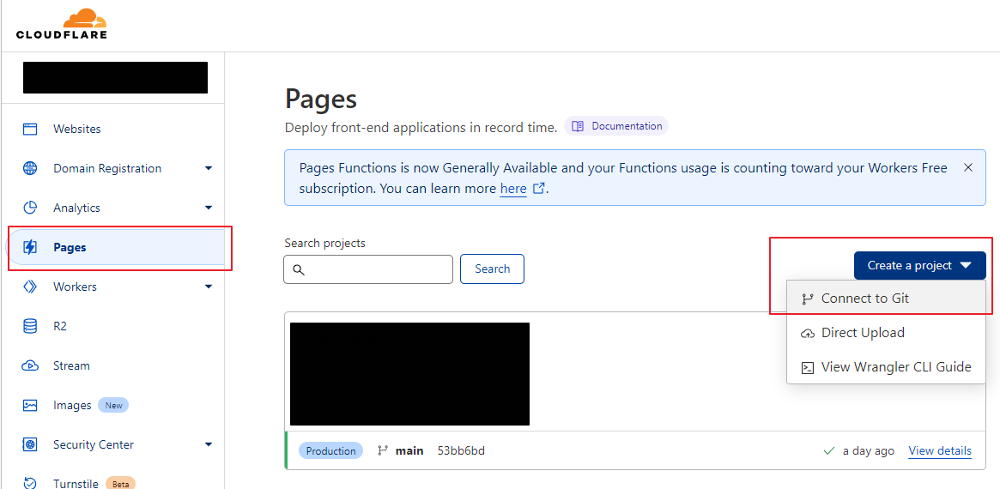
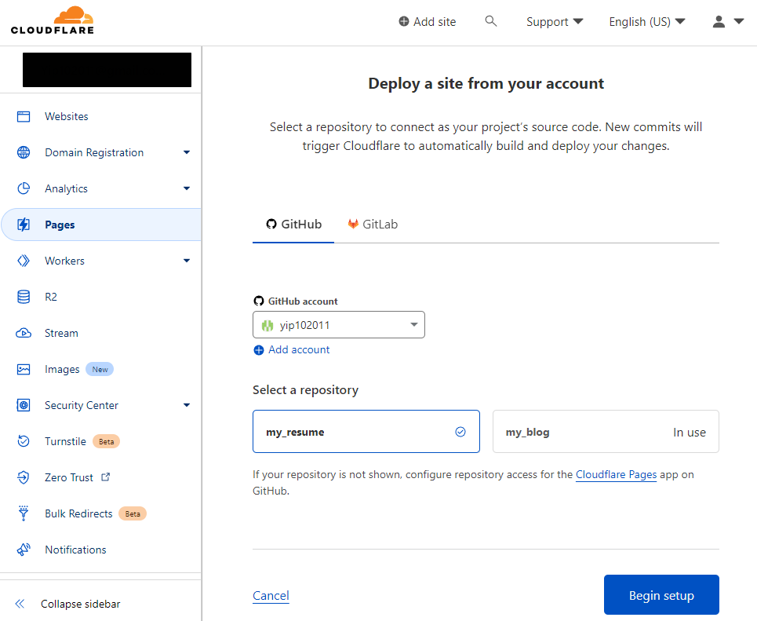
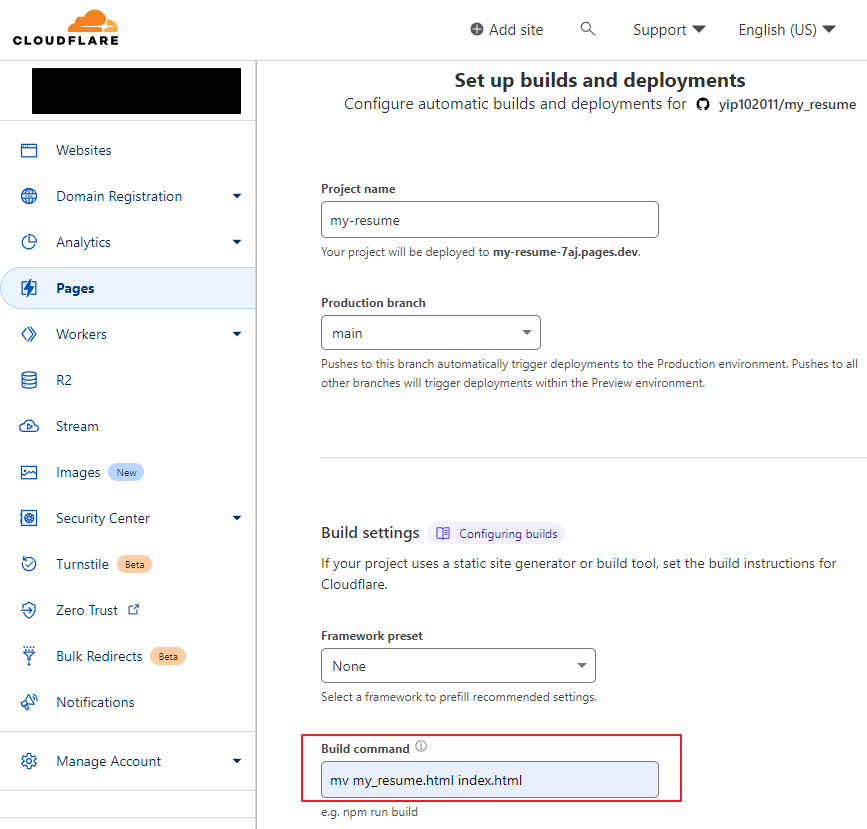
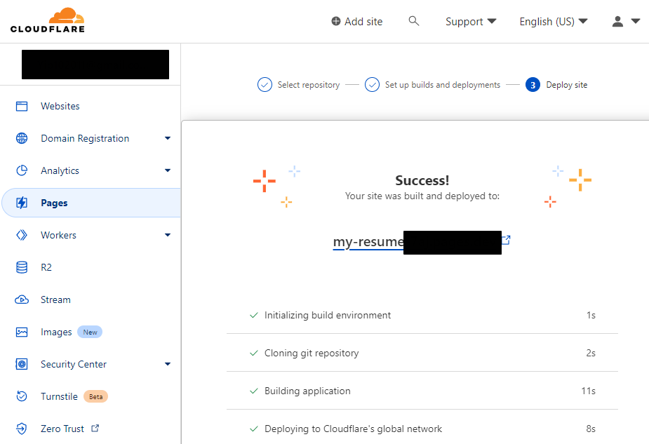
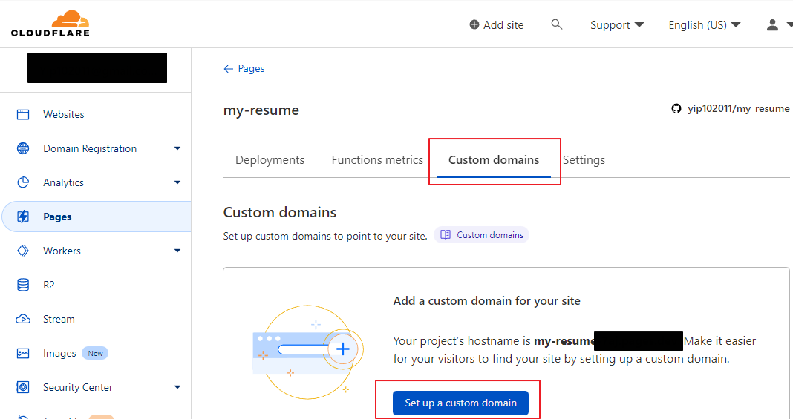
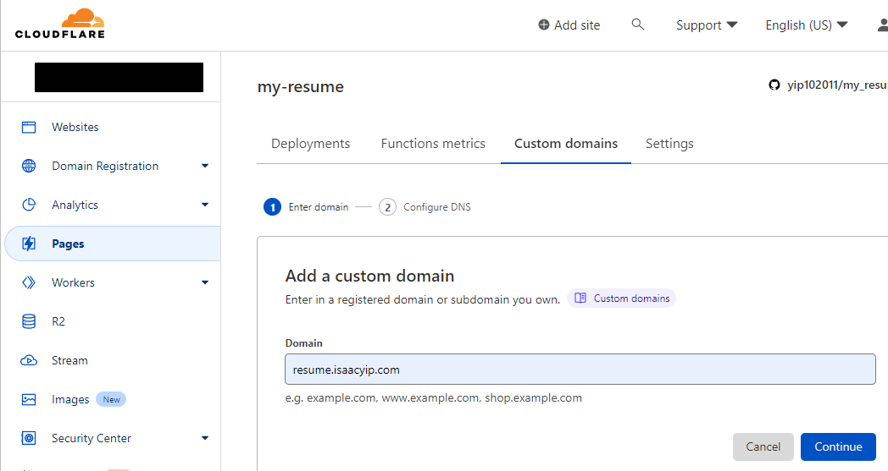
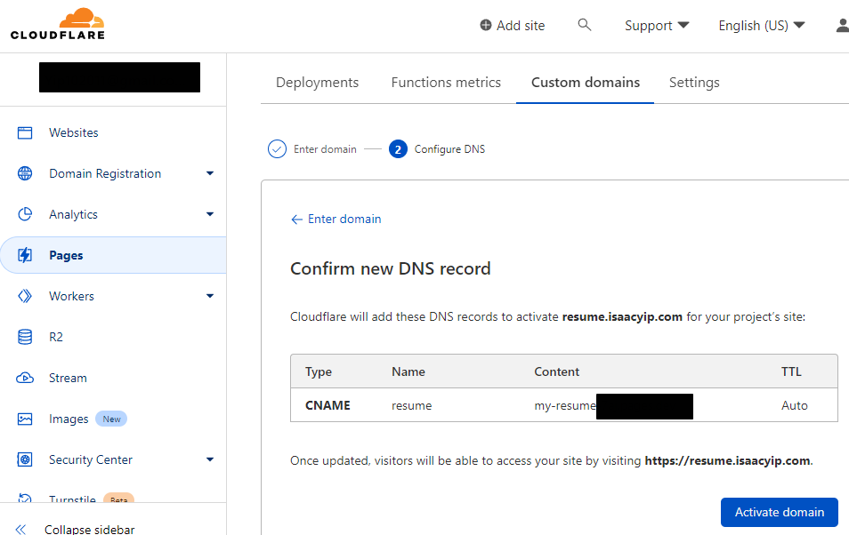
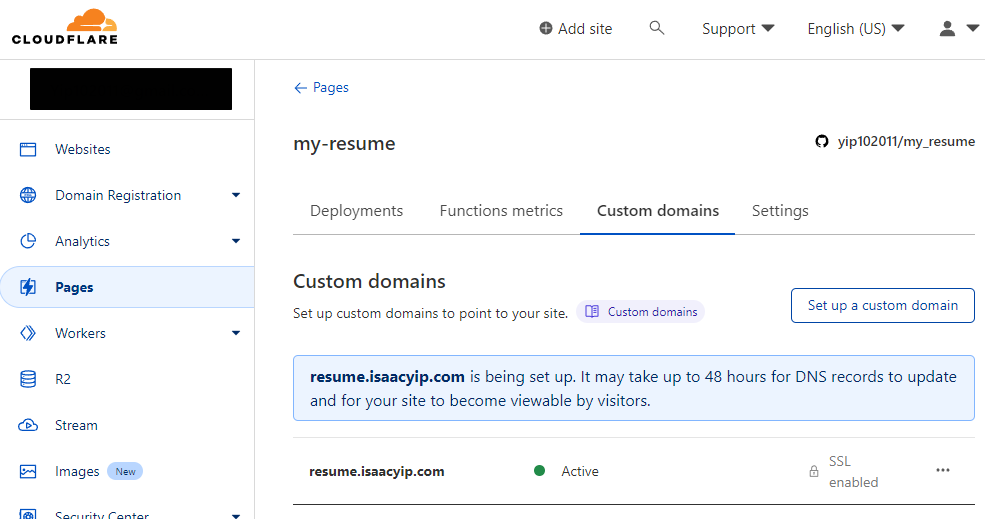

I will show you how i create my resume page and deploy to cloudflare pages. Here is my live resume <https://resume.isaacyip.com/>.

<!--more-->

1. Create a repo with your resume html page on github. You can fork my repo [here](https://github.com/yip102011/my_resume)
2. Buy a domain name in cloudflare.
3. Once you bought a domain, login cloudflare, goto `Pages > Create project > Connect to Git`
   
4. Add your github account and select your resume repository.
   
5. since cloudflare only take `index.html` as default page, we will rename our resume html file to `index.html` in build command.
   
6. When the build success you can see your website on the url. Then click `Continue to project`.
   
7. Setup your domain name for the page.
   
   
   
8. Wait a few minutes, until the domain turn to Active, then you can access your resume page with your domain
   