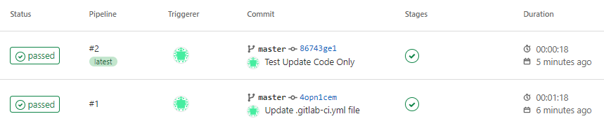

When using gitlab ci, it always take a long time to build docker image because cache is not used.  
Here is how to setup executer using local cache to speedup build time.

<!--more-->

## When do you need this?

If you have a standalone server that only used for gitlab runner, Shell Executor or[Use Docker socket binding](https://docs.gitlab.com/ee/ci/docker/using_docker_build.html#use-docker-socket-binding) should be enough for you. You can skip this article.

If you can bear few minutes build time, just use [kaniko](https://docs.gitlab.com/ee/ci/docker/using_kaniko.html) or [Use Docker-in-Docker](https://docs.gitlab.com/ee/ci/docker/using_docker_build.html#use-docker-in-docker).

Keep watching if you don't want to use socket binding or shell executor and want to reduce docker build time from few minutes to few seconds.

## Setup GitLag Runner

1. get registation token from gitlab admin panel, `/admin/runners`

2. set var

   ```bash
   GITLAB_HOST=192.168.0.11
   GITLAB_PORT=443
   GITLAB_URL="https://${GITLAB_HOST}:${GITLAB_PORT}/"
   REGISTRATION_TOKEN="xxxxxxxxxxxxx"

   HARBOR_HOST=192.168.0.12
   HARBOR_PORT=443

   DEPLOY_FOLDER=/srv/gitlab-runner
   ```

3. perpare file ane folder

   ```bash
   mkdir -p ${DEPLOY_FOLDER}
   mkdir -p ${DEPLOY_FOLDER}/config
   mkdir -p ${DEPLOY_FOLDER}/config/certs
   cd ${DEPLOY_FOLDER}

   # download gitlab server certificate
   openssl s_client -showcerts -connect ${GITLAB_HOST}:${GITLAB_PORT} < /dev/null 2>/dev/null | sudo openssl x509 -outform PEM > ${DEPLOY_FOLDER}/config/certs/${GITLAB_HOST}.crt

   # download harbor server certificate
   openssl s_client -showcerts -connect ${HARBOR_HOST}:${HARBOR_PORT} < /dev/null 2>/dev/null | sudo openssl x509 -outform PEM > ${DEPLOY_FOLDER}/${HARBOR_HOST}.crt
   ```

4. register gitlab runner and generate config file

   ```bash
   sudo docker run --rm -v ${DEPLOY_FOLDER}/config:/etc/gitlab-runner/ docker.io/gitlab/gitlab-runner:v15.8.2 register \
    --non-interactive \
    --tag-list="dind-runner" \
    --name="dind-runner" \
    --executor "docker" \
    --docker-image "docker:23" \
    --docker-tlsverify="false" \
    --run-untagged="true" \
    --custom_build_dir-enabled \
    --builds-dir="/builds" \
    --docker-volumes="/builds:/builds" \
    --env='GIT_CLONE_PATH=$CI_BUILDS_DIR/$CI_CONCURRENT_ID/$CI_PROJECT_NAME' \
    --cache-dir="/cache" \
    --docker-volumes="/cache:/cache" \
    --docker-volumes="/var/run/docker.sock:/var/run/docker.sock" \
    --docker-volumes="/etc/docker/certs.d:/etc/docker/certs.d" \
    --url="${GITLAB_URL}" \
    --registration-token="${REGISTRATION_TOKEN}"
   ```

5. update concurrent to 10

   ```bash
   sudo sed -i 's/concurrent.*/concurrent = 10/' ${DEPLOY_FOLDER}/config/config.toml
   ```

6. create docker-compose file

   ```bash
   echo "
   services:
     dind:
       container_name: dind
       image: docker:23-dind
       restart: always
       privileged: true
       environment:
         # force docker deamon to disable TLS
         DOCKER_TLS_CERTDIR: ''
       command:
         - --storage-driver=overlay2
       networks:
         - gitlab-runner
       volumes:
         - ${DEPLOY_FOLDER}/${HARBOR_HOST}.crt:/etc/docker/certs.d/${HARBOR_HOST}/ca.crt

     runner:
       container_name: runner
       restart: always
       image: docker.io/gitlab/gitlab-runner:v15.8.2
       depends_on:
         - dind
       environment:
         - DOCKER_HOST=tcp://dind:2375
       volumes:
         - ${DEPLOY_FOLDER}/config:/etc/gitlab-runner
       networks:
         - gitlab-runner

   networks:
     gitlab-runner: {}
   " > ${DEPLOY_FOLDER}/docker-compose.yml
   ```

7. start container `cd ${DEPLOY_FOLDER} && docker compose up -d --wait`
8. view logs `docker compose logs -n 100 -f`

you can download [single script file here]("/setup_gitlab_runnere.sh")

## create gitlab-ci file

create `.gitlab-ci.yml` file in your git project and commit, it will trigger pipline

```yaml
build-docker-image:
  stage: deploy
  tags:
    - docker-dind-runner
  variables:
    CI_REGISTRY: 192.168.0.12:443
    CI_REGISTRY_USER: admin
    CI_REGISTRY_PASSWORD: xxxxxxxx
  script:
    - docker login -u "$CI_REGISTRY_USER" -p "$CI_REGISTRY_PASSWORD" $CI_REGISTRY
    - docker build . -t "${CI_REGISTRY}/apps/${CI_PROJECT_PATH_SLUG}:latest" --build-arg BUILDKIT_INLINE_CACHE=1
    - docker push "${CI_REGISTRY}/apps/${CI_PROJECT_PATH_SLUG}:latest"
```


I am using a new dotnet webapi as demo, the first build takes 01:18 but second build only take 18s with code update. As long as you don't update `.csproj` file, you can use docker build layer local cache.

you can watch job container created inside dind container when trigger job

```bash
docker exec -t dind watch -n 1 docker ps
```


also setup crontab to clearup every month prevent disk full

```bash
(crontab -l && echo "0 0 1 * *  docker exec dind docker system prune --all --force --filter 'until=168h'") | crontab -
(crontab -l && echo "0 0 1 * *  docker exec dind docker system prune --all --force --volumes") | crontab -
crontab -l
```
