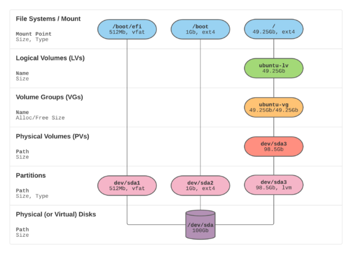

My linux cheat Sheet base on Ubuntu

<!-- more -->

## basic

```bash
# create multi line file
cat <<EOT > multi_line_file.txt
line1
line2
EOT

# create multi line file with tee
sudo tee -a ~/.ssh/config << EOF
Host localhost
  ForwardAgent yes
EOF

# check memory usage
htop
free -h
```

## awk

```bash
# skip first line, useful for skip colume name
awk 'NR!=1 {print}'
# filter when colume one not match regex pattern
awk '$1 !~ /^some-regex-pattern$/ {print}')
# print colume 1, 2 and added "|" in between
awk '{print $1"|"$2}')
# print with right padding space
awk '{printf "%-20s %-20s\n",$1,$2}'
```

## ssh

```bash
# gen key pair (id_rsa, id_rsa.pub) in folder `/home/admin/.ssh/`
ssh-keygen

# upload key for login (append key to user@remote_host:~/.ssh/authorized_keys)
ssh-copy-id user@remote_host

# ssh tunnel
ssh user@remote_host -L <local_port>:<target_host>:<target_port>

# scp upload folder
scp -r "~/some_folder" user@remote_host:~/
```

## sync time with hk ntp server

```bash
# create config file
mkdir -p /etc/systemd/timesyncd.conf.d/
cat <<EOT > /etc/systemd/timesyncd.conf.d/hk_ntp.conf
[Time]
NTP=stdtime.gov.hk
EOT
# set timezone
timedatectl set-timezone 'Asia/Hong_Kong'
# restart timesyncd service
systemctl restart systemd-timesyncd

# check status
timedatectl timesync-status
timedatectl show-timesync
```

IPv6 users may also access NTP service through `time.hko.hk`

> - ref: https://man7.org/linux/man-pages/man5/timesyncd.conf.d.5.html
> - ref: https://www.hko.gov.hk/en/nts/ntime.htm

## add apt repo

```bash
# add repo
echo "deb http://tw.archive.ubuntu.com/ubuntu/ jammy main" > /etc/apt/sources.list.d/apt_tw_mirror.list
apt update
```

`deb [ option1=value1 option2=value2 ] uri suite [component1] [component2] [...]`

- `deb`: `deb` or `deb-src`, deb-src means include source code, only used when you want to modify source code
- `uri`: repo uri, **launchpad** provides some repo [here](https://launchpad.net/ubuntu/+archivemirrors)
- `suite`: **usually** use ubuntu version code name [here](https://wiki.ubuntu.com/Releases)
- `component`: **usually** have four option
  - main - Officially supported software
  - restricted - Supported software that is not available under a completely free license.
  - universe - Community maintained software, i.e. not officially supported software.
  - multiverse - Software that is not free

> - ref: https://manpages.ubuntu.com/manpages/xenial/man5/sources.list.5.html
> - ref: https://help.ubuntu.com/community/Repositories/Ubuntu

## extend disk size

```bash
# check total dir size
du -sh /var/*

# check disk size
df -h

# expand vm linux disk
sudo apt install parted
sudo parted -l
(parted) resizepart 1 100%
(parted) quit
sudo resize2fs /dev/sda
```

## extend disk size (with logical volume manager)




```bash
# ref: https://packetpushers.net/ubuntu-extend-your-default-lvm-space/

# rescan disk size
echo 1 | sudo tee /sys/class/block/sda/device/rescan

# resize disk
sudo cfdisk # step: resize > write > quit

# resize pv
sudo pvresize /dev/sda3

# extend logical volumes
sudo lvextend -l +100%FREE /dev/ubuntu-vg/ubuntu-lv

# display lv
sudo lvdisplay

# resize filesystem
sudo resize2fs /dev/mapper/ubuntu--vg-ubuntu--lv
```

## disable swap and kswapd0

```bash
# turnoff swap
swapoff -a

# 0 swappiness really prevents from any swapping even if there is a swap storage available
echo 'vm.swappiness=0' | sudo tee /etc/sysctl.d/swappiness_zero.conf

# reload all sysctl config
sysctl --system

# search swap unit
systemctl list-units *swap* --all

# mask and stop swap unit permanently
systemctl mask swap.target
systemctl stop swap.target

# verify
free -m
sysctl vm.swappiness
systemctl status *swap* --all
```

> ref: [kernel swappiness](https://www.kernel.org/doc/html/latest/admin-guide/cgroup-v1/memory.html?highlight=swappiness#swappiness)

## find command

```bash
# search log file
find /var/log -iname '*.log' -type f

# search dir
find $HOME -iname 'php' -type d

# search file bigger than 10MiB
find $HOME -type f -size +10M

# search file created more than 7 days
find $HOME -type f -ctime +7

# search file modified within 60 mins
find $HOME -type f -mmin -60

# move
find $HOME -type f -name "*.txt" -exec move {} ./new_dir/ \;
```

> ref: [Linux manual page - find](https://man7.org/linux/man-pages/man1/find.1.html)

## archive log files

```bash
# zip log file
find /var/log -regextype posix-egrep -regex '.*/.*([0-9]{8})$' -exec gzip {} \;

# move ziped log files to other folder with same dir structure
LOG_ARCHIVED_FOLDER=/mnt/data/log_archived/
cd /var/log
find . -type d -exec mkdir -p "$LOG_ARCHIVED_FOLDER/{}" \;
find . -type f -name '*.gz' -exec mv --backup "{}" "$LOG_ARCHIVED_FOLDER/{}" \;
```

## skip sudo password

```bash
echo "$USER ALL=(ALL) NOPASSWD: ALL" | sudo tee /etc/sudoers.d/$USER
```

## reference

- [The Linux Kernel](https://www.kernel.org/doc/html/latest/index.html)
- [Linux manual page](https://man7.org/linux/man-pages/)
- [Ubuntu Docs](https://ubuntu.com/server/docs/installation)
