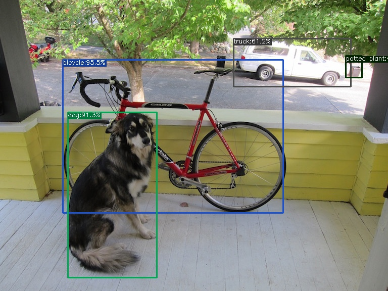
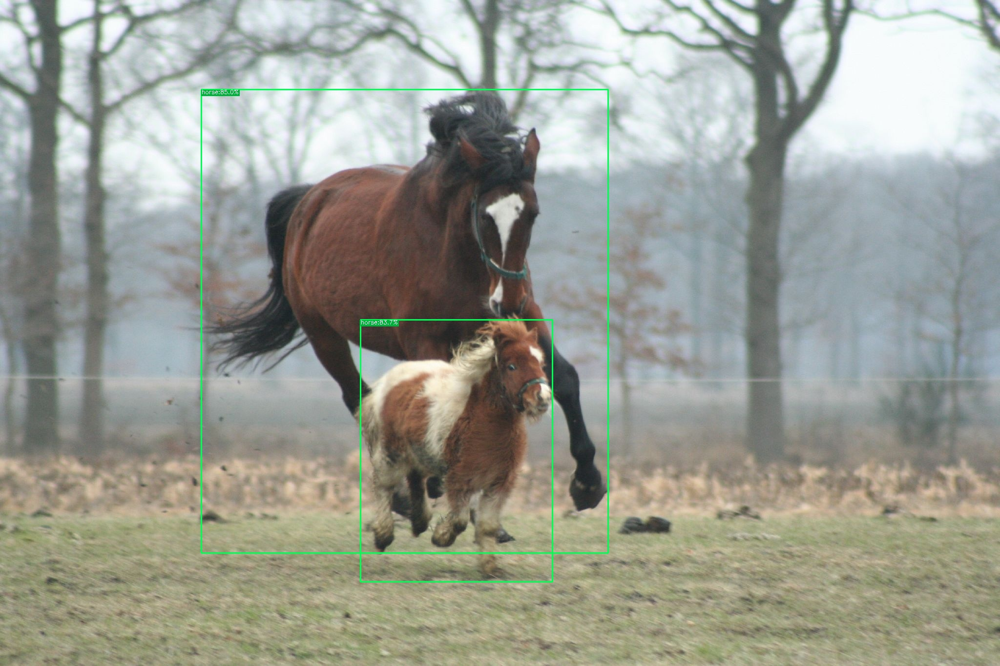

# 使用 YOLOX 從圖片偵測物件

由於工作上需要從影片或圖片中偵測物件，所以學習一下，本文只有實際操作，沒有任何理論(因為太難了(๑´ㅁ`))。

## 為什麼選 YOLOX
因為 YOLOX 使用 Apache-2.0 license，可以用作任何用途而不受任何限制，由 MEGVII-曠視科技 在2021年開源。

## 安裝

源代碼在 github (https://github.com/Megvii-BaseDetection/YOLOX)，但由於版本比較舊，不同的linux版本，python版本，cuda版本會有沖突，安裝時有很多問題。
建議使用我建立的Docker映像檔安裝。

從github下載映像檔。
```bash
docker pull ghcr.io/yip102011/yolox:latest
```

啟動容器
```bash
docker run -it -d --gpus all --name yolox ghcr.io/yip102011/yolox:latest
```

## 從圖片偵測物件

執行示範
```bash
docker exec yolox python tools/demo.py image -f exps/default/yolox_s.py -c weights/yolox_s.pth --path assets/dog.jpg --save_result
```

日誌輸出
```log
2026-03-03 05:59:29.211 | INFO     | __main__:main:259 - Args: Namespace(demo='image', experiment_name='yolox_s', name=None, path='assets/dog.jpg', camid=0, save_result=True, exp_file='exps/default/yolox_s.py', ckpt='weights/yolox_s.pth', device='cpu', conf=0.3, nms=0.3, tsize=None, fp16=False, legacy=False, fuse=False, trt=False)
2026-03-03 05:59:29.350 | INFO     | __main__:main:269 - Model Summary: Params: 8.97M, Gflops: 26.93
2026-03-03 05:59:29.351 | INFO     | __main__:main:282 - loading checkpoint
2026-03-03 05:59:29.412 | INFO     | __main__:main:286 - loaded checkpoint done.
2026-03-03 05:59:29.530 | INFO     | __main__:inference:165 - Infer time: 0.1098s
2026-03-03 05:59:29.531 | INFO     | __main__:image_demo:202 - Saving detection result in ./YOLOX_outputs/yolox_s/vis_res/2026_03_03_05_59_29/dog.jpg
```

從容器複製圖片到本機
```bash
## 複製結果到 workspace
docker exec yolox find /workspace/YOLOX/YOLOX_outputs/yolox_s/vis_res/ -name sheep.jpg -exec cp {} /workspace/ \;
## 複製結果到本機
docker cp yolox:/workspace/dog.jpg ./result-dog.jpg
```


在網上下載照片測試
```bash
## 下載照片
docker exec yolox wget https://upload.wikimedia.org/wikipedia/commons/9/98/Horse-and-pony.jpg -O assets/horse.jpg --no-verbose
## 執行
docker exec yolox python tools/demo.py image -f exps/default/yolox_s.py -c weights/yolox_s.pth --path assets/horse.jpg --save_result
## 複製結果到 workspace
docker exec yolox find /workspace/YOLOX/YOLOX_outputs/yolox_s/vis_res/ -name horse.jpg -exec cp {} /workspace/ \;
## 複製結果到本機
docker cp yolox:/workspace/horse.jpg ./result-horse.jpg
```


預訓練模型基於 COCO2017 數據集訓練，可以偵測80種物件。可偵測物件列表: <https://github.com/Megvii-BaseDetection/YOLOX/blob/main/yolox/data/datasets/coco_classes.py>

## 使用 GPU

```bash
## 移除運行中的容器
docker stop yolox
docker rm yolox

## 執行示範
docker exec yolox python tools/demo.py image -f exps/default/yolox_s.py -c weights/yolox_s.pth --path assets/dog.jpg --save_result --device gpu
```