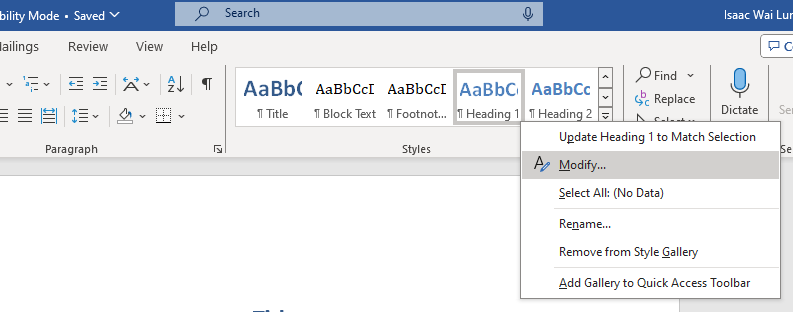
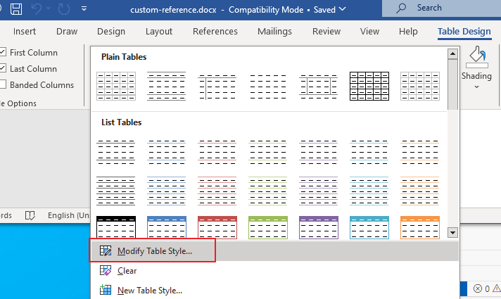
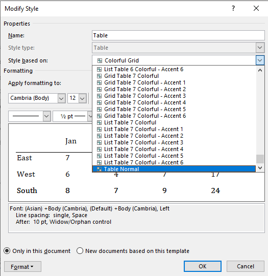
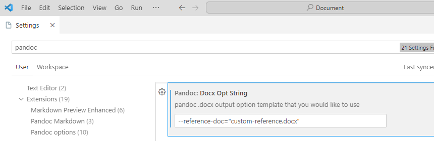

How to export markdown file to word docx file 

<!-- more -->

# Export markdown to word docx file

## Install Pandoc

Install pandoc from https://pandoc.org/installing.html

## modify style

1. export default style docx, open it.

   ```shell
   pandoc -o custom-reference.docx --print-default-data-file reference.docx
   ```

2. modify header style
   

3. modify table style

   Select table, click `Table Design` on top bar.  
   Select `Table Normal`
   
   

4. save docx file

## Export markdown file to docx file

4. config vscode settings  
   add `--reference-doc="custom-reference.docx"` to "Docx Opt String"
   

5. exoprt markdown to docx file
   
